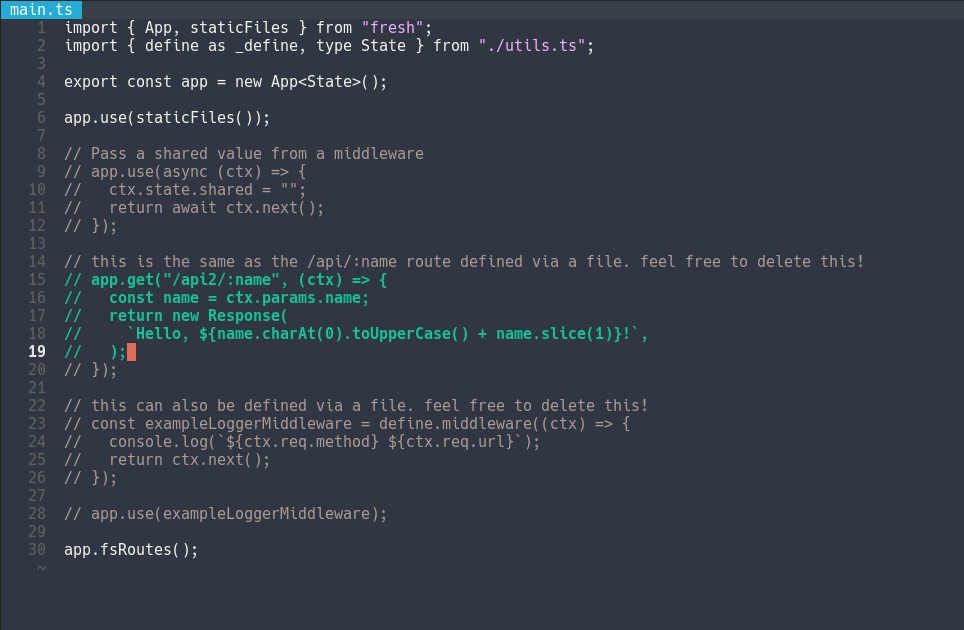

<h1 align="center">Synthwave</h1>

is a minimalistic night theme for the Helix Editor.

    

 

1. Copy **synthwave.toml** to $HOME/.config/helix/themes/
2. Add `theme = "synthwave"` to $HOME/.config/helix/config.toml
